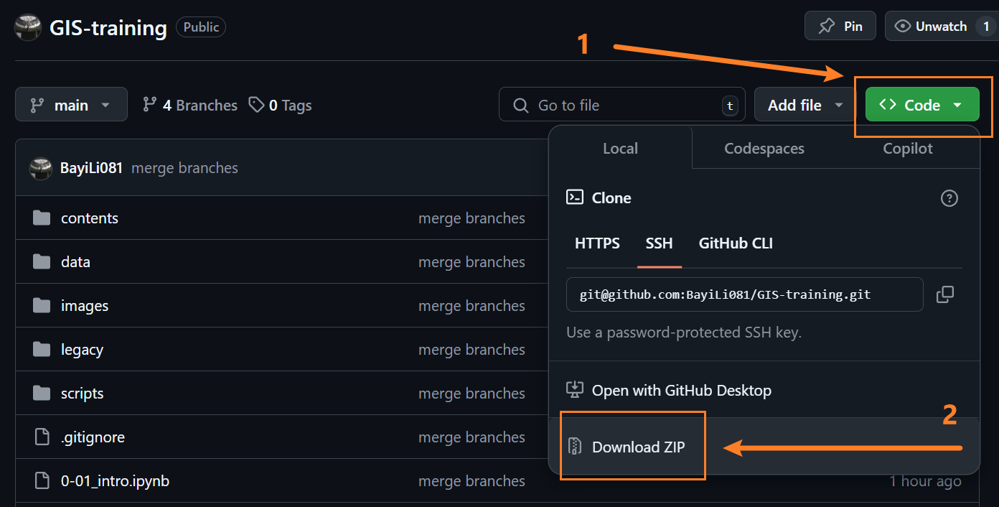
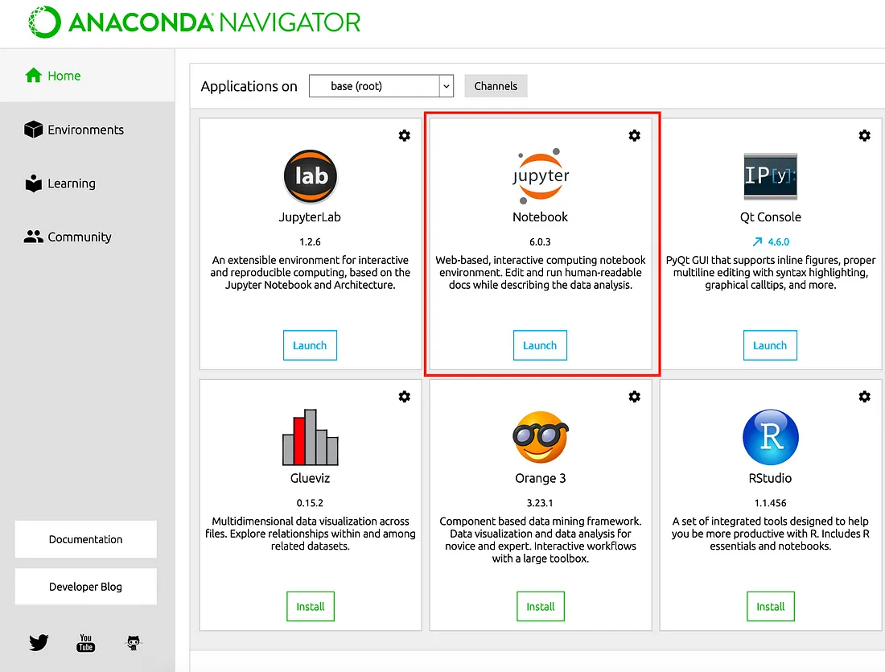
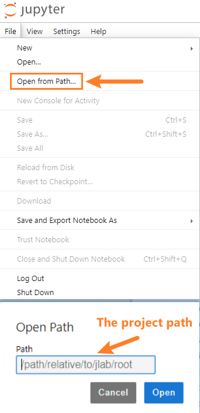
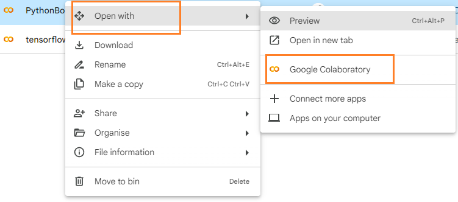

# Preparation

## Materials Downloads

Go to https://github.com/BayiLi081/GIS-training and download the GitHub Repository as zip.

**Unzip** it to the drive of your laptop. 

## Software Requirements

In this bootcamp, we will be using **Jupyter Notebook**. But firstly, we need to have Python environment ready. 

There are two options to do so: 

1. Install it locally
2. Use cloud-based platforms

*Note:* For the long term, local environment is more stable and can be used off-line. In case of you failed to install it locally, feel free to adopt the second option.

### Local Installation: Python Anaconda

1. Follow the [Official Install Instructions](https://docs.anaconda.com/anaconda/install/) for Python Anaconda

2. Open the Anaconda Navigator application:

Click the "Launch" button under "Jupyter Notebooks" and navigate through your file system to the this folder you downloaded above.

|  |
| ------------------------------------------------------------ |
| Source and Recommended Reading: [Towards Data Science: Virtual Environments in Anaconda Jupyter notebook](https://towardsdatascience.com/virtual-environments-in-anaconda-jupyter-notebook-f92cda7184fa) |

---

**Is the installation not working?** 

**Don't worry**

Setting up a Python programming environment can be both complex and time-consuming. 

There are many cloud-based Jupyter Notebook platforms available online. 

But at this case, you need to have a **Google account**. Because we will be using Google Colab as a substitute of local developing environment.

### Cloud Environment: Google Colab

1. Please create an account on [Google Colab](https://colab.research.google.com/). (You can login with your own exist Google account)

2. Ensure you are able to access [Google Drive](https://drive.google.com/drive/my-drive)

   Upload the previous downloaded and unzipped folder to your Google Drive.

3. Ensure you are able to login to the [Google Colab](https://colab.research.google.com/)

*Note:* Anaconda or Google Colab are not the only way of setting a Python developing environment. If you already know how to set up and start the Jupyter Notebook before. Feel comfortable to use it in your way.

## Environment Check

If you run it locally, navigate your Jupyter Notebook to the bootcamp directory (the path of unzipped folder). 

|  |  |
| ------------------------------------------------------------ | ------------------------------------------------------------ |
| (Local option) Navigate Jupyter Notebook to the project directory | (Cloud option) Upload the project folder to Google Drive, and open Jupyter Notebook using Google Colab directly from Google Drive |

Then, go through the steps of **[0-02_environment.ipynb](./0-02_environment.ipynb)**, and check if you can run them properly.

# Table of Contents

## Part I: Python Fundamentals and Geospatial Data

### [1-01: Data Types and Structures](./jupyters/1-01_data.ipynb)

We will begin by introducing common Python data types, including **integers, floats, and strings**. Additionally, two widely used data structures, **lists and dictionaries**, will be covered to demonstrate how to organise and manipulate data effectively in Python.

---

### [1-02: DataFrame and GeoDataFrame](./jupyters/1-02_dataframe_geo.ipynb)

Python offers a robust way to manage **tabular data** through the **Pandas** library, which includes the versatile **DataFrame** structure and a variety of associated functions. 

For geospatial data, the **GeoDataFrame** (provided by the GeoPandas library) serves as the equivalent, enabling spatial analysis. 

---

### [1-03: Questionnaires and Survey Data Cleaning](./jupyters/1-03_questionnaires.ipynb)

Surveys, a common method of collecting opinions, often produce rich yet complex datasets.  

In survey responses, these datasets typically include **categorical, textual, and numerical variables**.  

We will address tasks such as **recoding categorical variables** and summarising the characteristics of **categorical variables** and **textual variables**.

---

## Part II: Spatial Data Analysis

Geospatial data is commonly categorized as **vector** or **raster** data. 

### [2-01: Vector Data Analysis](./jupyters/2-01_vector.ipynb)

Learn to read **vector data** from formats like **GeoJSON, Shapefile, and KML**. This section covers basic spatial analysis with **GeoDataFrames**, including **spatial queries, joins**, and **plotting**. You'll also calculate key spatial attributes for **points, lines**, and **polygons**, and explore methods for analysing **point density, intersections**, and **buffers**.

---

### [2-02: Raster Analysis](./jupyters/2-02_raster.ipynb)

Raster data consists of cells of a fixed size and is widely used in **remote sensing**. In this section, we will calculate **Normalized Difference Vegetation Index (NDVI)**, plot it and filter the NDVI index value, showcasing a practical application of raster analysis.

---

### [2-03: Network Analysis](./jupyters/2-03_network.ipynb)

Networks can represent geographic, real-world, or social systems. Among these, road networks are the most common type in urban data.

In this session, we will use **OSMnx** and **NetworkX** to acquire the road network for Singapore and assess **point-to-point network distances**.

## Part III: Advanced Visualization

### [3-01: Geocoding](./jupyters/3-01_datawrangling_geo.ipynb)

 This section will also cover **geocoding**, the process of translating textual address information into geographic coordinates. Technique like **Caching data** will be also included.

### [3-02: Data Visualization](./jupyters/3-02_datavis.ipynb)

For datasets with multiple variables, **Exploratory Data Analysis (EDA)** is an essential method for understanding **data distributions and intercorrelations**. We will create high-quality visualizations using Python libraries like **Matplotlib** and **Seaborn**, enabling clear communication of insights.

### [3-03: Static and Interactive Mapping](./jupyters/3-03-01_staticmapping.ipynb)

Geospatial data can be translated into meaningful maps using GIS tools. Static maps are ideal for academic publications, while interactive maps can engage broader audiences. In this section, we will use **Cartopy** and **Folium** to create both **static and interactive choropleth maps**.