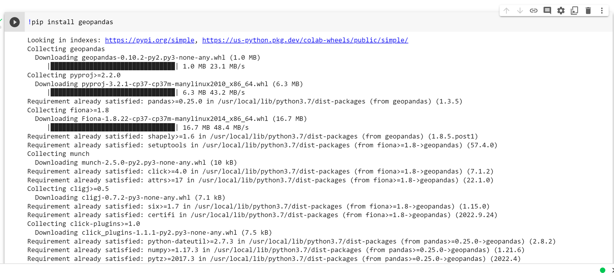
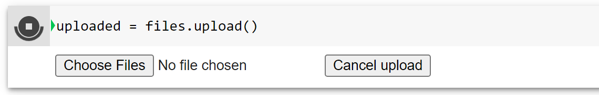

# Google Colab Using Tutorial

By Li Bayi, Email: barryli081@gmail.com

Date: 19/10/2022

---

[Google Colab](https://colab.research.google.com/) allows you to write and execute Python in your browser, you can also find a tutorial video [Get started with Google Colaboratory (Coding TensorFlow) - YouTube](https://www.youtube.com/watch?v=inN8seMm7UI) here for basic understanding of this platform.

After signing in with your existing Google account or new account, create a new notebook with the name you want (in this tutorial, we call it **PythonBootcamp.ipynb**)

The libraries we are going to use include:

> numpy, pandas, seaborn, geopandas, kepler and PySAL

To install them on the google colab:

type in ```!pip install <library_name>``` and ```ctrl+enter``` or ```shift_enter``` to run the code block



## Upload from local drive

To upload from your local drive, start with the following code:

```python
from google.colab import files
import io
```

```python
uploaded = files.upload()
```

It will prompt you to select a file. Click on “**Choose Files**” then select and upload the file. Wait for the file to be 100% uploaded. You should see the name of the file once Colab has uploaded it.



Finally, type in the following code to import it into a dataframe:

```python
df2 = pd.read_csv(io.BytesIO(uploaded[<Filename.csv>])) # Read the Dataset as Pandas Dataframe
```

Click ```Cancel upload```, but we will use this function in the following tutorial.