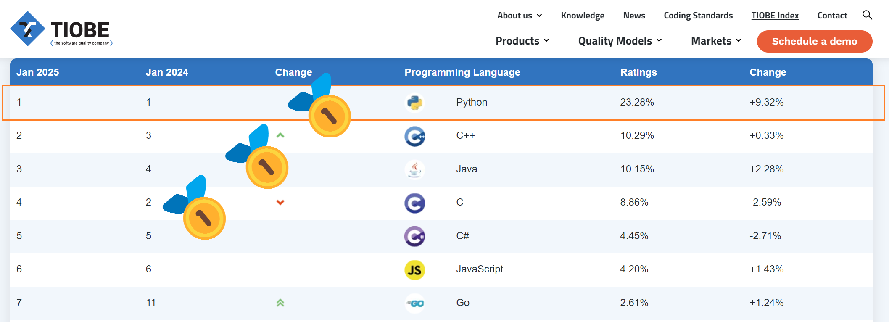

# Bootcamp: Introduce to Geospatial Python

[](https://lkycic.sutd.edu.sg/)

[](https://creativecommons.org/licenses/by/4.0/)

**Course Hours:** 3 hours x 3 sessions

**!!! Important !!! Perquisites:** Before the bootcamp, please go to the **[preparation section](./0-01_intro.md)** to make sure you have correctly set up the developing environment for Python.

## Prerequisites:

1. Laptop to use in hands-on session
2. Internet connection
3. Preferred to have basic knowledge in GIS

## Objectives

The main objectives of this bootcamp are: 

- A better understanding of Python as a programming language that enables **urban data science**
- Write simple scripts to improve efficiency of geospatial processing
   - Geospatial Data Manipulation
   - Geospatial Data Analysis

- Basic visualisation of geospatial data

All contents will be delivered in a hybrid manner of **Lecture and Practice**.

## Why Python

  

1. **Easy to learn and use:** Python's syntax is relatively simple because it closely resembles natural language.  
2. **Large community and support:** Python is the most popular programming language (TIOBE Index, January 2025). This means extensive libraries, frameworks, and tutorials are readily available.  
3. **Versatile and powerful:** Python can be used for a wide range of applications, including web development, data analysis, artificial intelligence, scientific computing, and more.  

### Python in Urban Data Science  

1. **Integration with GIS software:** Python is preinstalled in popular graphical interfaced GIS tools such as [QGIS: PyQGIS](https://qgis.org/pyqgis/master/) and [ArcGIS: ArcPy](https://www.esri.com/en-us/arcgis/products/arcgis-python-libraries/libraries/arcpy).  
2. **Extensive libraries for geospatial analysis:** In addition to general data science libraries, Python offers a growing range of geospatial analysis tools. Representative libraries include:  
   - **[GeoPandas](https://geopandas.org/en/stable/getting_started.html):** Extends pandas to support spatial operations on geometric types.  
   - **[NetworkX](https://networkx.org/):** Models and analyses the structure of networks. 
   - **[PySAL](https://pysal.org/explore/):** A library for spatial data analysis.  
   - **[Geopy](https://geopy.readthedocs.io/en/stable/):** Enables geocoding and geospatial calculations.  
   - **[Folium](https://python-visualization.github.io/folium/latest/):** Creates interactive maps using Leaflet.  
   - **[Cartopy](https://scitools.org.uk/cartopy/docs/latest/):** Focuses on cartographic projections and geospatial data visualisation.  
   - **[Shapely](https://shapely.readthedocs.io/en/stable/):** Enables manipulation and analysis of planar geometric objects.  
   - **[PyProj](https://pyproj4.github.io/pyproj/stable/):** Provides cartographic projections and coordinate transformations.  
   - **[Fiona](https://fiona.readthedocs.io/en/stable/):** Facilitates reading and writing vector data.  
   - **[Rasterio](https://rasterio.readthedocs.io/en/stable/):** Supports reading and writing geospatial raster data.  
   - **[GDAL](https://gdal.org/en/stable/):** Handles raster and vector geospatial data formats.  

We will cover use cases of some of these libraries. More importantly, we will explore how to utilise them to address research questions encountered in urban research.  

## Table of Contents

### Part I: Python Fundamentals and Geospatial Data

1. Data type and structures
2. DataFrame and GeoDataFrame
3. Questionnaires and Survey Data Cleaning

### Part II: Spatial Data Analysis

1. Vector data analysis
2. Raster data analysis
3. Network analysis

### Part III: Advanced Visualisation

1. Geospatial data wrangling
2. Data Visualization
3. Static and Interactive Mapping

Please go through [Table of Contents](0-01_intro.md#table-of-contents) to see more details.

## Organising Data and Files  

Organising all the files for a Python project can be challenging, especially when project grows. It is, therefore, crucial to establish a systematic file structure. A recommended project file structure could be:  

```bash
project/
│
├── README.md
│
├── data/
│   ├── raw_data/
│   │   ├── raw_dataset1.csv
│   │   └── raw_dataset2.csv
│   ├── intermedia_data/
│   │   ├── intermedia_dataset1.csv
│   │   └── intermedia_dataset2.csv
│   ├── processed_data/
│   │   ├── processed_dataset1.csv
│   │   └── processed_dataset2.csv
│   └── README.md
│
├── scripts/
│   ├── data_processing.py
│   ├── analysis.py
│   └── visualisation.py
│
└── results/
    ├── figures/
    └── summary_report.pdf
```

### Naming and File Path Guidelines  

- **Ensure that file paths do not contain spaces or non-ASCII characters (e.g., Chinese characters).** 

- **Use underscores in naming:** This is recommended in the [PEP 8 style guide](https://peps.python.org/pep-0008/#function-and-variable-names).  

**Why follow these guidelines?**  

1. **Spaces in names:** Variable names cannot contain spaces, and spaces in file names can cause issues, particularly in command-line environments.  

2. **Non-ASCII characters:** Different operating systems and file systems handle non-ASCII characters inconsistently, which can lead to problems when sharing files across platforms.  

# References

1. [dlab-berkeley/Python-Geospatial-Fundamentals](https://github.com/dlab-berkeley/Python-Geospatial-Fundamentals)
1. [GEOG 160: Mapping our Changing World](https://www.e-education.psu.edu/geog160/)


