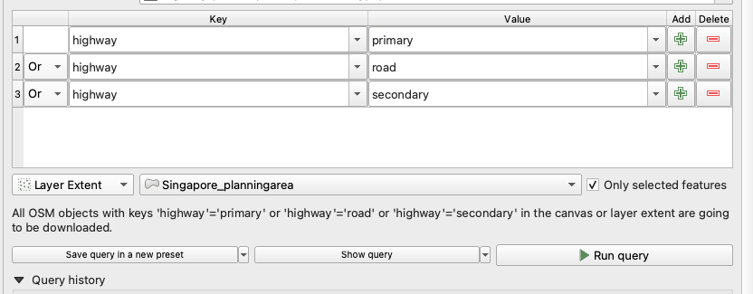

# Create a map with essential elements in QGIS

## Installing QGIS Plugins

You may refer [about plugins in QGIS](qgis_plugins.md) to understand how to install and use some popular QGIS plugins to boost efficiency.


## Download road network with QGIS plugin - QuickOSM

### Install QuickOSM through the plugin manager

1. Plugins - Manage and install plugins
2. Key in "QuickOSM"
3. "install plugin"
4. Two buttons of QuickOSM will be displayed in the top panel of main window

### Install HCMGIS through the plugin manager

Select a basemap from the HCMGIS services

### Download the data

Click the QuickOSM button (green one) or go to Vector - QuickOSM - QuickOSM

1. Select which entities you want to query from OSM database

```sql
"highway" = 'primary' OR "highway" = 'road' OR "highway" = 'secondary'
```

Detail about key-value pairs used in OSM can read from [OSM wiki: Key:highway](https://wiki.openstreetmap.org/wiki/Key:highway)

2. Select the spatial extent of the data
3. Run query

It should take a while to acquire the data depending on the scale of query.

Due to time issue, limit the query area to the planning area Tampines (Load the Singapore planning area shpfile first):

1. Use the **Identify Features** to read the information of selected feature.
2. Use the **Select Features by Area or Single click** to actually select the feature you want to limit your query area to Tampines
3. Run the query (**Layer Extent -> Singapore_planningarea->Only selected features**)



4. The difference of temporary layer and save as file
5. Save the file as tampines_mainroad.shp and remove the temporary layers

### Clear the useless columns of the data

Take a look of the dbf file, which contains a lot of information, but a lot of columns which is unnecessary and slow down the further analysis.

Use **Retain Fields** or **Drop Fields** to downsize the file (tampines_mainroad.shp).

## Add exist data to the Map

Drag the [Singapore_mainland_roadnetwork.shp](../../../GIS-bootcamp_qgisfiles/data/bus_stops_singapore.shp) into the canvas of QGIS

## Basic Elements of a Map

1. Title: 

   A concise and descriptive title that summarizes the main theme or purpose of the map.

2. Legend or Key:

   A legend or key that explains the symbols, colors, and other features on the map and their meaning.

3. Scale: 

   A scale that shows the relationship between the distances on the map and the actual distances on the Earth's surface.

4. North arrow or compass rose: 

   A north arrow or compass rose that indicates the orientation of the map and helps the reader to identify the cardinal directions (north, south, east, and west).

Additions:

1. Data sources:

   A statement that identifies the sources of data used to create the map, including the date of data collection and the method used to obtain the data.

2. Projection:

   A projection that shows how the three-dimensional Earth is represented on a two-dimensional surface and helps to minimize distortion of geographic features.

3. Insets or Overview map:

   Insets or overview maps that provide additional information about a specific area or the larger context of the map.

## Generating the map

- Save spatial bookmarks (View -> Create new spatial bookmark) (Both Singapore and Tampines)
- Open the spatial bookmark manager
- Edit the exist spatial bookmark (open the bookmark editor from the content windows, and change the canvas extent and choose **Map Canvas Extent**)

### Create Print Layout

1. Create print layout from project in the top ribbon
2. Name it (for example, map_singapore)
3. **Add map** from the left tab
4. Add North arrow
5. Add Scale bar
6. Change the color of bar or font if its hard to identify due to mix with the map background
7. Add the legend (Remove unnecessary legend iterms from the properities of the legend tab)
8. Add the explainary text
9. Export the map as image
10. 


