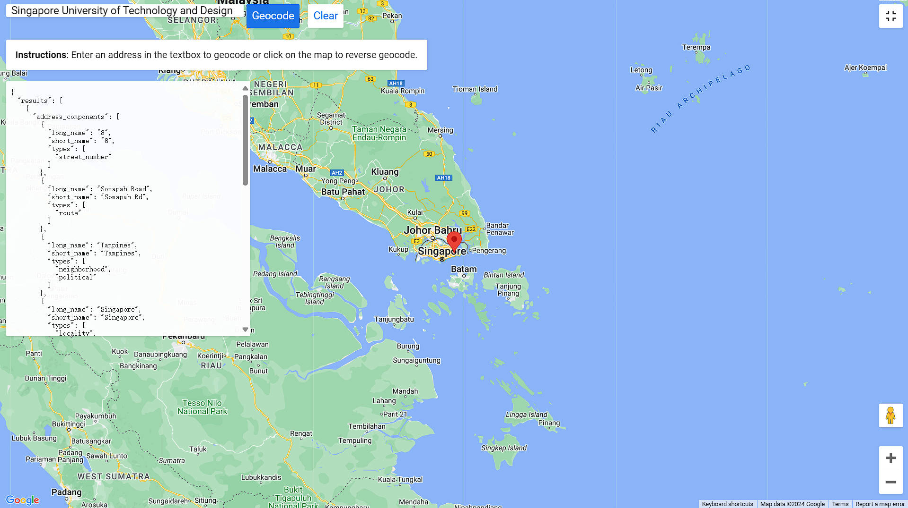

# Geocoding

Geocoding is the process where it converts address into spatial data and associates the exact geographical coordinates for that address.

|                   |
| ------------------------------------------------------------ |
| [Geocoding Service - Google for Developers](https://developers.google.com/maps/documentation/javascript/examples/geocoding-simple) |

The query result is returned in the format of json as following:

```
{
  "results": [
    {
      "address_components": [
        {
          "long_name": "8",
          "short_name": "8",
          "types": [
            "street_number"
          ]
        },
        {
          "long_name": "Somapah Road",
          "short_name": "Somapah Rd",
          "types": [
            "route"
          ]
        },
        {
          "long_name": "Tampines",
          "short_name": "Tampines",
          "types": [
            "neighborhood",
            "political"
          ]
        },
        {
          "long_name": "Singapore",
          "short_name": "Singapore",
          "types": [
            "locality",
            "political"
          ]
        },
        {
          "long_name": "Singapore",
          "short_name": "SG",
          "types": [
            "country",
            "political"
          ]
        },
        {
          "long_name": "487372",
          "short_name": "487372",
          "types": [
            "postal_code"
          ]
        }
      ],
      "formatted_address": "8 Somapah Rd, Singapore 487372",
      "geometry": {
        "location": {
          "lat": 1.341258,
          "lng": 103.9637585
        },
        "location_type": "ROOFTOP",
        "viewport": {
          "south": 1.339127669708498,
          "west": 103.9612536,
          "north": 1.341825630291502,
          "east": 103.9652256
        }
      },
      "partial_match": true,
      "place_id": "ChIJy2Dymdg82jERGFUCbbzKvpk",
      "plus_code": {
        "compound_code": "8XR7+GG Singapore",
        "global_code": "6PH58XR7+GG"
      },
      "types": [
        "establishment",
        "point_of_interest",
        "university"
      ]
    }
  ]
}
```

## Notes on the Postcode

- A postcode may represent a small area unit or branches of the same facilities, which cannot be used to identify an accurate location by postcode alone.

- Postcodes can change because countries may alter part of or the entire postcode system. In such cases, it is advisable to check the current effectiveness of the postcode system.

- In certain scenarios, multiple postcodes can be assigned to a single address for specific reasons (e.g., a large population residing in one place).

- Postcodes are not unique to a specific country. A postcode could refer to multiple locations in different countries; therefore, it is better always to specify the country name.

### Example of Indonesia's Postcode system

Indonesia's postcode system, known locally as "Kode Pos," is a five-digit numerical code used to simplify the sorting and delivery of mail.

The first two digits represent the province or metropolitan area, while the subsequent digits further refine the location to specific districts and sub-districts. A postcode generally cannot be used to identify a specific house. While postcodes help narrow down locations, they typically cover multiple houses, buildings, or even entire neighborhoods. 

To pinpoint a specific house, you would need additional address details such as the street name and house number.

## Reverse geocoding

At rare cases, we need to transform coordinates to addresses, namely reverse geocoding.

|                   |
| ------------------------------------------------------------ |
| [Reverse Geocoding - Google for Developers](https://developers.google.com/maps/documentation/javascript/examples/geocoding-reverse) |

## Useful tools

- [Google Maps Platform](https://developers.google.com/maps): Provides APIs for map, including for geocoding and reverse geocoding
- [Mapbox](https://mapbox.com): An alternative to Google Maps
- [Esri ArcGIS Platform or ArcGIS pro](https://esri.com): Design for Esri User, but with limitation of quota
- [Nominatum](https://nominatim.openstreetmap.org): An open source geocoding services
- [geopy](https://github.com/geopy/geopy): A Python library to use geocoding services

## Reference

1. [What is geocoding and how can it help sell products (geospatialworld.net)](https://www.geospatialworld.net/blogs/what-is-geocoding-and-how-can-it-help-sell-products/)
2. [Geocoding and postal codes, points to consider (opencagedata.com)](https://opencagedata.com/guides/how-to-think-about-postcodes-and-geocoding)
