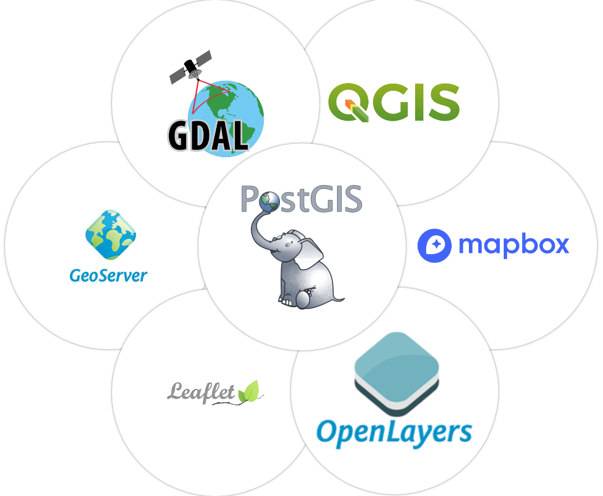
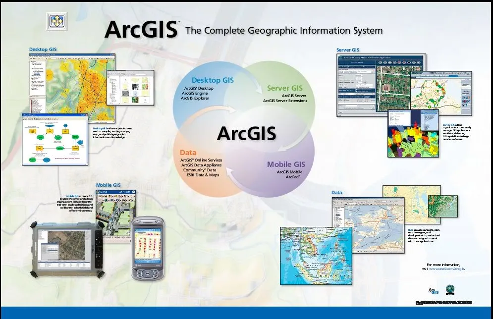

# Open-source and close-sourced solutions

## Open Sourced:

- Allowing others to adapt and build on top of the project

- Freely access and modify

More used in NGOs, small or grassroots organisations without the cost of software.

## Closed Sourced:

- Extensive supports and traning on their products
- A integrated products line: such as you can almost find all the GIS-related products in ESRI with great integrations between different products
- Might have stronger security features, and more stable and reliable releases of software regularly

More common for large companies and organisations to use ArcGIS products. 

You can basically find all the solution using open sourced software.

The layout of interfaces, the name of analysis tool and the analysis function might be slightly different, but overall, it is not that hard to switch between each other.

In this bootcamp, **QGIS** will be used for several advantages:

- Open source (Free to use)
- Cross-Platform (Mac, Windows and Linux)
- Integration with Python (Although ArcGIS Pro has Jupyter notebook integrated inside)
- A wider range of plugins and extensions
- More file format supported especially for open-source and proprietary formats such as GeoJSON
