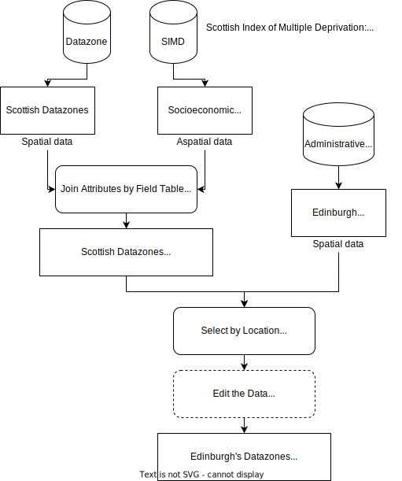

# Recap of Day 1

- Spatial and non-spatial (attribute) data model
- A practice of how to join spatial data (ESRI shapefile) with non-spatial data (csv)
- Overlay selection
- Edit shape in QGIS

- Global univariate spatial autocorrelation pattern analysis -- Moran's Index
- A small practice of how to calculating Moran's Index in QGIS or GeoDa
- How to add basemap using HCMGIS plugin in QGIS
- How to set up right coordinate reference system in QGIS