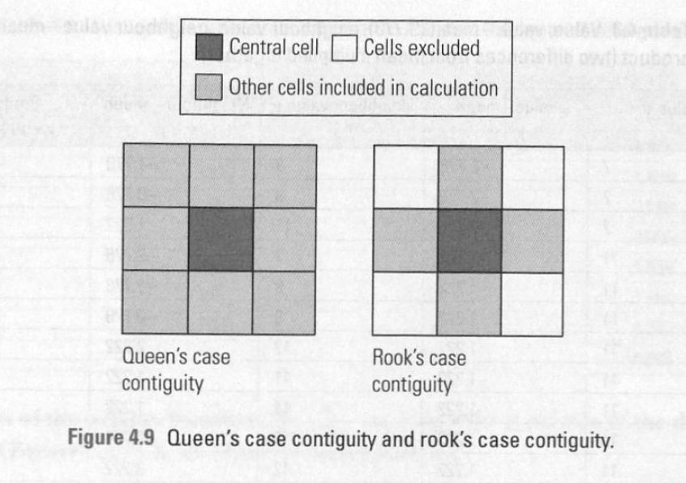

# Spatial Autocorrelation

| ![Conceptual models of spatial autocorrelation. Positive spatial autocorrelation (a) is associated with a clustering, or aggregating, phenomenon. Positive spatial autocorrelation was observed for all fungal and tree communities at small scales and also across the extent of the study (Fig. 2). Negative spatial autocorrelation (b) was observed for all fungal communities at intermediate scales (3.7–26 km). No spatial autocorrelation (c) is associated with randomly spaced distribution patterns for fungal communities and is also the null hypothesis used in Mantel tests](../imgs/spatialautocorrelation_001.png) |
| ------------------------------------------------------------ |
| Source: [Scale-Dependent Influences of Distance and Vegetation on the Composition of Aboveground and Belowground Tropical Fungal Communities](https://www.researchgate.net/publication/345326470_Scale-Dependent_Influences_of_Distance_and_Vegetation_on_the_Composition_of_Aboveground_and_Belowground_Tropical_Fungal_Communities) |

**Discernible spatial pattern**

- Positive spatial autocorrelation

  **Similar values** of a variable are found near each other in space. 

- Negative spatial autocorrelation

  Neighboring areas or locations have **dissimilar values** for a particular attribute or feature being measured.

**Outcome of Randomness: No spatial pattern**

- No spatial autocorrelation (spatial randomness)

  Absence of any discernible pattern or relationship between neighboring locations in a spatial dataset. 

  This means that the values of a particular attribute or feature being measured are not influenced by the values of nearby locations and are instead distributed randomly across the study area.

## Global Moran's I

The formula for calculating Global Moran's I is as follows:

$$
I=\frac{n}{\sum_{i=1}^{n}\sum_{j=1}^{n}w_{ij}}\cdot\frac{\sum_{i=1}^{n}\sum_{j=1}^{n}w_{ij}(x_{i}-\bar{x})(x_{j}-\bar{x})}{\sum_{i=1}^{n}(x_{i}-\bar{x})^{2}}
$$


n is the number of cases

xi and xj denote the attribute values at location i, j

x-bar is the mean value of the variable across all spatial units

w_ij denote weights from the spatial weight matrix

> Moran's I is a statistical measure that quantifies the presence and strength of spatial autocorrelation, measuring the overall spatial autocorrelation of spatial data set. 
>
> It ranges from **-1 to 1**

> As suggested by Glazier et al. (2004), values of Moran’s I > 0.2 or < 0.2 indicate that significant SAC has occurred. 

- A positive Moran's I value (Significant positive)

  Similar values tend to be located close to each other in space. 

- A negative Moran's I value (Significant negative)

  Dissimilar values tend to be located close to each other. 

- A Moran's I value close to zero (Insignificant / Random)

  Values are distributed randomly in space

## Calculating Moran's I in QGIS

Data: Scottish Index of Multiple Deprivation

Attributes: Employment

### Preparation

1. Clip the datazones within Edinburgh's boundary out using the  [Edinburgh_Community_Council_Boundaries.geojson](../data/simd2020_withgeog/Edinburgh_Community_Council_Boundaries.geojson) (Intersect and delete the extra ones, because there are not topologically aligned with neigbour zones)

   **Save only selected features**

2. Join table with the datazones within Edinburgh's boundary, only keep the necessary attributes

   **Join attributes by field value**

   **Layer 2 fields to copy: only select employment rate and Data_Zone**

3. Open the field tab in the properties of the layer, which shows the employment field is in text type. So it is not accepted in further mathematical calculation.

   Open field calculator, tick create a new field, give it a name with field type decimal number, leave others as default.

   In the expression window, key in

   ```
   to_real(replace( "employment" , '%', ''))/100
   ```

   Click ok

### Processing

Install the plugin "Spatial Analysis Toolbox" in the Plugins manager

The tool relies on other libraries and hasn't been updated for a year. So it probrary returns a bunch of errors due to lack of dependent libraries or incompatible issues.

> pip install pandas pyproj fiona geopandas libpysal esda mgwr

To install packages in QGIS Python environment:

>For mac / linux users:
>
>You need find the Python interpreter path first:
>
>/Applications/QGIS.app/Contents/MacOS/bin/python3.X -m ensurepip
>
>/Applications/QGIS.app/Contents/MacOS/bin/python3.X -m pip install pandas pyproj fiona geopandas libpysal esda mgwr
>
>(X depends on the Python version that QGIS uses, similar with linux system)
>
>For windows user:
>
>1. Open OSGeo Shell (py3_env to activate python environment, if needed)
>2. Get fiona whl file (based on your system and python version) https://www.lfd.uci.edu/~gohlke/pythonlibs/#fiona
>3. Then pip install *Path To whl file*
>
>3. pip install pandas pyproj shapely geopandas libpysal esda mgwr

The plugin with the new spatial analysis tools will be shown at the bottom of the processing toolbox.

So, if you have trouble installing it or runing it properly, you could download GeoDa instead of spending too much time configuring it.

**What is Queen contiguity, Rook contiguity, K Nearest Neighbors and Distance Band**

|  |
| ------------------------------------------------------------ |
| Source: Lloyd, C. (2010). Spatial data analysis: an introduction for GIS users. Oxford university press. |
|  |
| Source: [K-Nearest Neighbors](https://towardsdatascience.com/knn-k-nearest-neighbors-1-a4707b24bd1d) |
|               |
| Source: [Calculate Distance Band from Neighbor Count (Spatial Statistics)](https://pro.arcgis.com/en/pro-app/latest/tool-reference/spatial-statistics/calculate-distance-band-from-neighbor-count.htm) |

After running the Moran's I tool, QGIS will generate a Moran's I report that includes the Moran's I index, z-score, and p-value. You can interpret these results to determine the presence and strength of spatial autocorrelation in your dataset.

- Is the result significant?

- What is the Moran's I value?
- What it means?

## Applications of Moran's I in Urban Research

Spatial autocorrelation is used to identify patterns of land use or urban development. For example, by analyzing the spatial autocorrelation of housing prices, researchers can identify areas with similar prices and then investigate the underlying factors that drive the prices.

### Example 01: 

Xu, C., Pribadi, D.O., Haase, D. and Pauleit, S., 2020. Incorporating spatial autocorrelation and settlement type segregation to improve the performance of an urban growth model. *Environment and Planning B: Urban Analytics and City Science*, *47*(7), pp.1184-1200.

In this study, global Moran's I is used to detect the spatial autocorrelation of land use data (high- and low-density settlement types).

Spatial pattern of settlement growth

The author compared the performace of urban growth model with different settlement types.


### Example 02:

Havard, S., Deguen, S., Zmirou-Navier, D., Schillinger, C. and Bard, D., 2009. Traffic-related air pollution and socioeconomic status: a spatial autocorrelation study to assess environmental equity on a small-area scale. *Epidemiology*, pp.223-230.


## Example 03:

Xu, Y., Santi, P. and Ratti, C., 2022. Beyond distance decay: Discover homophily in spatially embedded social networks. *Annals of the American Association of Geographers*, *112*(2), pp.505-521.


|  |
| ------------------------------------------------------------ |
| Source: The spatial patterns of average housing price at the level of Voronoi cells. (B) Global Moran’s *I* is computed over the housing prices at these Voronoi cells. The analysis and report are derived from ESRI’s ArcGIS product. |


